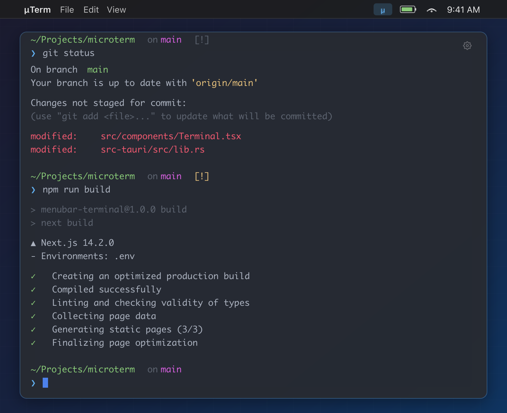

# µTerm (MicroTerm)

[](https://github.com/ttaatoo/menubar-terminal/actions/workflows/ci.yml)
[](https://opensource.org/licenses/MIT)
[](https://tauri.app)
[](https://www.apple.com/macos/)

A micro terminal that lives in your macOS menubar. Lightweight, fast, always one click away.

Built with **Rust**, **Tauri 2.0**, and **Next.js 14**.

<p align="center">
  
</p>

## Features

- 🎯 **Menubar Access** - Always one click away from your terminal
- ⚡ **Lightning Fast** - Native Rust backend with minimal memory footprint
- 🖥️ **Full PTY Support** - Real terminal emulation with xterm.js
- 🎨 **Beautiful UI** - One Dark Pro Vivid theme with transparency
- 📜 **Command History** - Navigate with up/down arrows
- 🔗 **Clickable Links** - URLs are automatically detected and clickable
- 🪟 **Smart Window** - Click outside to dismiss, works across all spaces

## Installation

### Download

Download the latest release from the [Releases](https://github.com/ttaatoo/menubar-terminal/releases) page.

### Build from Source

#### Prerequisites

- **Rust** (1.70+) - Install from [rustup.rs](https://rustup.rs/)
- **Node.js 18+** and npm
- **macOS 10.13+**

#### Steps

```bash
# Clone the repository
git clone https://github.com/ttaatoo/menubar-terminal.git
cd menubar-terminal

# Install dependencies
npm install

# Build the application
npm run build
npm run tauri build
```

The built application will be in `src-tauri/target/release/bundle/`.

## Development

```bash
# Install dependencies
npm install

# Run in development mode (starts both Next.js and Tauri)
npm run tauri dev
```

## Usage

1. **Open** - Click the menubar icon (µ) to open the terminal
2. **Type** - Enter commands and press Enter to execute
3. **Navigate** - Use Up/Down arrows to browse command history
4. **Close** - Click outside the window or click the icon again

## Tech Stack

| Component  | Technology            |
| ---------- | --------------------- |
| Backend    | Rust + Tauri 2.0      |
| Frontend   | Next.js 14 + React 18 |
| Terminal   | xterm.js              |
| PTY        | portable-pty          |
| macOS APIs | objc2 + objc2-app-kit |

## Project Structure

```
menubar-terminal/
├── src/                    # Next.js frontend
│   ├── app/               # App Router pages
│   ├── components/        # React components
│   │   └── XTerminal.tsx  # Terminal UI
│   ├── lib/               # Utilities
│   └── styles/            # CSS styles
├── src-tauri/             # Rust backend
│   ├── src/
│   │   ├── lib.rs         # Window & tray behavior
│   │   ├── commands.rs    # Shell command execution
│   │   ├── pty.rs         # PTY session management
│   │   └── pty_commands.rs
│   └── capabilities/      # Tauri permissions
├── .github/workflows/     # CI/CD
└── docs/                  # Documentation
```

## Contributing

Contributions are welcome! Please read our [Contributing Guide](CONTRIBUTING.md) before submitting a PR.

## Changelog

See [CHANGELOG.md](CHANGELOG.md) for a list of changes.

## License

This project is licensed under the MIT License - see the [LICENSE](LICENSE) file for details.

## Acknowledgments

- [Tauri](https://tauri.app) - For the amazing framework
- [xterm.js](https://xtermjs.org) - For the terminal emulator
- [One Dark Pro](https://github.com/Binaryify/OneDark-Pro) - For the color theme inspiration
